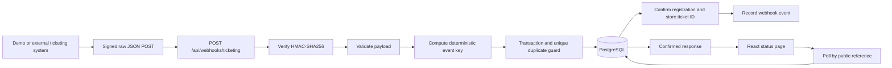
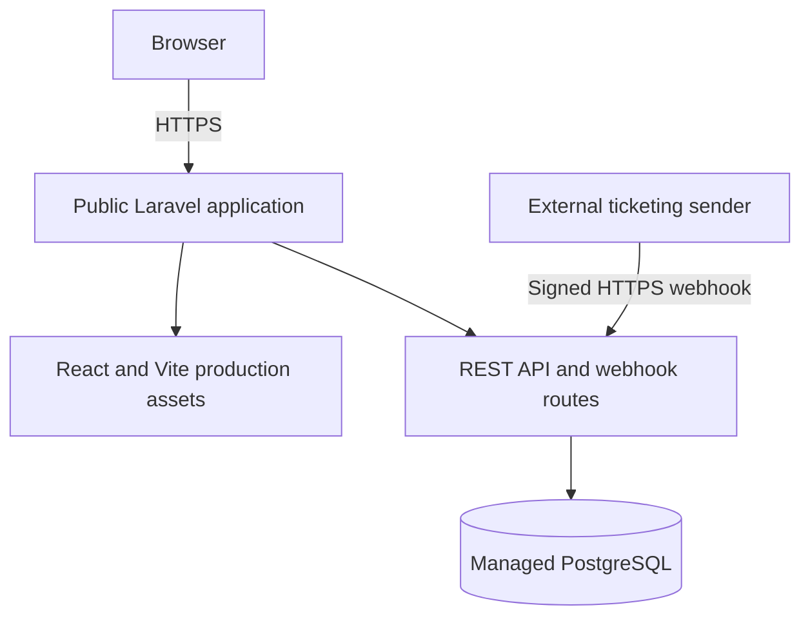

# EventFlow Architecture Plan

## Goal

Build the smallest secure, testable application that demonstrates the PDF's central flow:

`event selection -> registration -> pending reference -> signed ticket webhook -> confirmed status`

The application will be one Laravel deployment. Laravel exposes REST endpoints and serves React/Vite production assets; PostgreSQL stores events, registrations, and webhook logs.

## Planned repository structure

```text
app/
  Http/
    Controllers/Api/
      EventController.php
      RegistrationController.php
      TicketingWebhookController.php
      DemoTicketingController.php
    Requests/
      StoreEventRequest.php
      UpdateEventRequest.php
      StoreRegistrationRequest.php
      TicketingWebhookRequest.php
    Resources/
      EventResource.php
      RegistrationResource.php
  Models/
    Event.php
    Registration.php
    WebhookEvent.php
  Services/
    RegistrationService.php
    TicketingWebhookService.php
    DemoTicketingService.php
database/
  factories/
  migrations/
  seeders/
docs/
  ARCHITECTURE.md
  REQUIREMENTS.md
resources/js/
  components/
    EventCard.jsx
    RegistrationForm.jsx
    StatusBadge.jsx
  pages/
    EventsPage.jsx
    RegistrationPage.jsx
    RegistrationStatusPage.jsx
  services/
    api.js
  App.jsx
  main.jsx
routes/
  api.php
  web.php
tests/Feature/
  EventApiTest.php
  RegistrationTest.php
  TicketingWebhookTest.php
.env.example
AGENTS.md
AI.md
README.md
```

Only files proven useful during implementation will be created. The three small services are planned because transaction-heavy registration, webhook idempotency, and self-HTTP demo signing would otherwise make controllers harder to explain; they are not a generic service layer.

## HTTP/API plan

| Method | Route | Purpose |
|---|---|---|
| `GET` | `/api/events` | List available events for React. |
| `POST` | `/api/events` | Create an event. |
| `GET` | `/api/events/{event}` | View one event. |
| `PATCH` | `/api/events/{event}` | Update an event. |
| `POST` | `/api/events/{event}/registrations` | Validate and create a pending registration safely. |
| `GET` | `/api/registrations/{reference}` | Return the minimal status data needed by React. |
| `POST` | `/api/webhooks/ticketing` | Required signed external ticket webhook. |
| `POST` | `/api/registrations/{reference}/demo-confirmation` | Server-side interview-demo trigger that calls the real webhook. |

The lookup and demo endpoints are minimal implementation support for the PDF's required updated-status demonstration. The event APIs have no delete route, and there are no accounts, payments, tickets/PDFs, emails, dashboards, or other product features.

## Laravel request flow

### Registration

```mermaid
flowchart LR
    A[Browser] --> B[React registration form]
    B --> C[Laravel API route]
    C --> D[StoreRegistrationRequest]
    D --> E[RegistrationController]
    E --> F[RegistrationService]
    F --> G[DB transaction]
    G --> H[Lock event row]
    H --> I[Check availability and capacity]
    I --> J[(PostgreSQL)]
    J --> K[Create pending registration]
    K --> L[JSON reference and status]
    L --> M[React status page]
```



The event row lock serializes registrations for the same event. The transaction holds the lock until commit or rollback, so two requests cannot both observe and consume the final place.

### Webhook and frontend refresh



Invalid signatures are rejected before business processing. A database unique constraint on the deterministic event key remains the final duplicate guard, including when duplicate requests arrive concurrently.

## React page plan

1. **Events page (`/`)** - fetches available events and displays loading, error, empty, and success states with a register action.
2. **Registration page (`/events/:eventId/register`)** - displays the selected event, collects the four required fields, prevents repeated submission, and maps Laravel validation errors to fields.
3. **Registration status page (`/registrations/:reference`)** - shows the reference, event, and pending/confirmed status; polls the lookup endpoint while pending and cleans up its timer on unmount.

React uses native `fetch` consistently and local component state/hooks. No global state library is needed for three pages.

## Webhook security and idempotency

1. The sender serializes the JSON body once.
2. It calculates `hash_hmac('sha256', rawBody, secret)`.
3. It places the lowercase hexadecimal result in `X-Webhook-Signature`.
4. Laravel reads the exact raw body and configured `WEBHOOK_SECRET`.
5. Laravel calculates the expected HMAC and compares it with `hash_equals`.
6. Only a valid signature proceeds to payload validation and database work.
7. Laravel hashes the stable supported fields (`event`, `registration_reference`, `ticket_id`, `status`) into `event_key`.
8. In one transaction, it creates the uniquely keyed webhook log and changes the matching registration from pending to confirmed.
9. A duplicate key is treated as an already-processed valid delivery: return success and make no second meaningful change.

The raw body matters because re-encoding parsed JSON can change whitespace/key formatting and therefore the signature. The secret is read only from server configuration and is never returned to React or stored in webhook logs.

## Test plan

The mandatory PDF scenarios map to focused Laravel feature tests:

| Scenario | Main assertions |
|---|---|
| Successful registration | `201`, unique `EVT-...` reference, `pending` response, correct database row. |
| Validation failure | `422`, expected field errors, no registration created. |
| Event capacity | Registration succeeds through the limit; the next request receives a conflict/unavailable response; row count stays at capacity. |
| Successful webhook | Correct HMAC is accepted; registration becomes confirmed; ticket ID and one processed webhook log exist. |
| Invalid signature | Request is unauthorized; registration and webhook log remain unchanged. |
| Duplicate webhook | Both valid deliveries receive idempotent responses; only one log/key and one effective state transition exist. |

Small event API tests will cover the required create/list/view/update behavior. A production Vite build, Laravel formatter, full test suite, manual browser flow, clean-clone rehearsal, and public-URL smoke test form later verification layers.

## Deployment plan



The provider will be chosen only after checking current PHP, build, PostgreSQL, environment-secret, migration, and HTTPS support. The application will use one public origin where possible to avoid unnecessary CORS complexity. Deployment documentation will contain only commands verified against the completed repository, and the live URL will be tested from a signed-out/private browser session.

## Key limitations intentionally within assignment scope

- No authentication or authorization because the PDF does not require it.
- No event deletion endpoint.
- Pending registrations reserve capacity; abandonment expiry is not part of the assignment.
- Polling is used instead of real-time sockets.
- Only the documented ticket-confirmation webhook event is supported.
- The demo ticketing action is for demonstrating the required external flow, not a production ticket-provider integration.

These decisions will be repeated in the final README so reviewers can distinguish deliberate scope from omissions.
